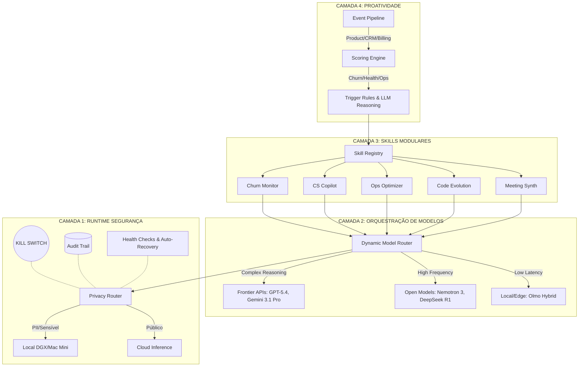

# 🏗️ FRANK_ARCHITECT v1.0 - BLUEPRINT 2026

## 1. DIAGRAMA ARQUITETURAL (4 CAMADAS)

## 2. ESPECIFICAÇÃO SKILLS V1 (5 SKILLS)

### Skill 1: Churn Monitor (Retenção Proativa)
*   **Objetivo:** Identificar queda de engajamento e intervir antes do cancelamento.
*   **Prompts:** "Analise a série temporal de logins do usuário {user_id}. Se a derivada for negativa por 3 dias, gere um email de reengajamento focado na feature {most_used_feature}."
*   **Exemplos (Few-shot):** [User A: drop 50% -> Email gerado], [User B: drop 10% -> Ignorar].
*   **Golden Sets:** 500 perfis históricos de churn para validação de precisão.
*   **KPIs:** Redução de churn rate em 15%, Falso Positivo < 5%.

### Skill 2: CS Copilot (Suporte Autônomo)
*   **Objetivo:** Rascunhar respostas de suporte baseadas no histórico do cliente e documentação interna.
*   **Prompts:** "O cliente {tier} relatou o erro {error_log}. Baseado no ticket {similar_ticket}, rascunhe uma resposta empática e técnica com a solução."
*   **Exemplos:** Resolução de erro de faturamento, Dúvida de API.
*   **Golden Sets:** 1000 tickets resolvidos com CSAT > 90%.
*   **KPIs:** Tempo de Resolução (TTR) reduzido em 40%, CSAT mantido ou elevado.

### Skill 3: Ops Optimizer (FinOps)
*   **Objetivo:** Monitorar billing da nuvem e sugerir/executar scale-downs.
*   **Prompts:** "O cluster {cluster_id} está com 15% de CPU há 12h. O custo atual é ${cost}/h. Gere o comando Terraform/Kubernetes para reduzir as réplicas para 2."
*   **Exemplos:** Scale down de final de semana, Identificação de instâncias zumbis.
*   **Golden Sets:** 50 cenários de desperdício de infraestrutura.
*   **KPIs:** Redução de Capex/Opex em 20%, Zero downtime induzido.

### Skill 4: Code Evolution (FRANK-SCAN)
*   **Objetivo:** Auto-melhoria contínua do próprio código baseada em tendências do GitHub/Fóruns.
*   **Prompts:** "Analise o diff {diff} para o arquivo {file}. Verifique se há vazamento de memória ou regressão de latência. Aprove ou rejeite com justificativa."
*   **Exemplos:** Otimização de loop React, Correção de memory leak no WebSocket.
*   **Golden Sets:** 200 PRs de otimização de performance open-source.
*   **KPIs:** Melhoria de latência em 5% por mês, 0 bugs introduzidos.

### Skill 5: Meeting Synthesizer (Produtividade)
*   **Objetivo:** Conectar-se ao calendário e áudio local para extrair action items.
*   **Prompts:** "Transcreva e resuma a reunião {meeting_id}. Extraia as tarefas atribuídas a {user_name} e formate como JSON para a API do Notion."
*   **Exemplos:** Reunião de planning, Call com cliente.
*   **Golden Sets:** 100 horas de reuniões transcritas com tarefas mapeadas manualmente.
*   **KPIs:** 95% de precisão na extração de action items, Latência < 10s pós-reunião.
